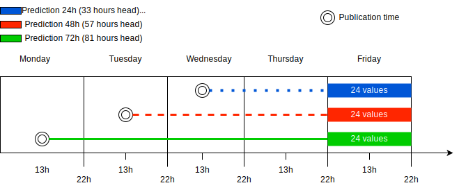
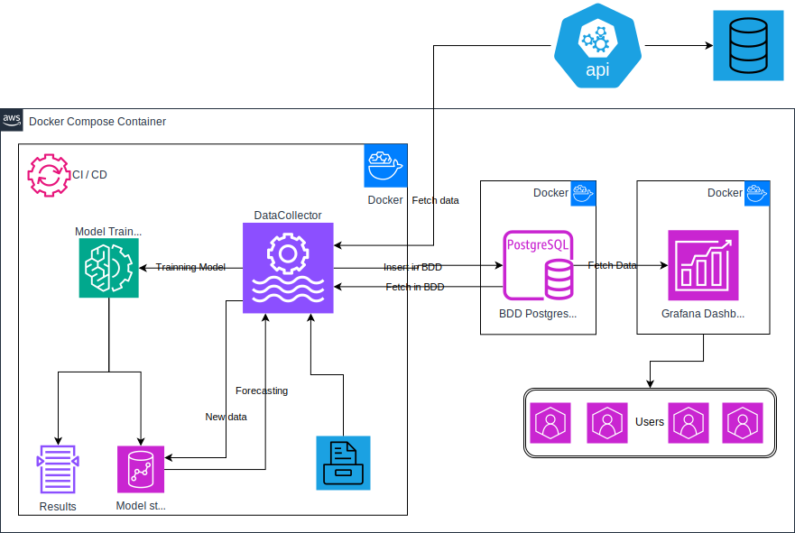

# Electricity Price Prediction Project


## Description

This project focuses on predicting electricity prices in Ireland using advanced machine learning (ML) and natural language processing (NLP) models. The primary objective is to forecast electricity prices 24, 48, and 72 hours ahead of the official SEMO PX (Single Electricity Market Operator Power Exchange) price publication at 13:00 each day, for the time period of 22:00 to 22:00 the following day.

### Prediction Process



This research aims to provide valuable insights for energy market participants, traders, and policymakers, enabling more informed decision-making in the dynamic Irish electricity market.

### Process Deployement



You can find the documentation [here](https://hugo35974.github.io/AI_MTU/index.html).


## Prerequisites
- Python >= 3.9
- pip (Python package manager)
- Git
- Docker and Docker Compose

## Installation

1. Clone the repository:
   ```bash
   git clone https://github.com/Hugo35974/AI_MTU.git
   ```

2. Navigate to the project directory:
   ```bash
   cd AI_MTU
   ```

3. (Optional) Create a virtual environment:
   ```bash
   python3 -m venv venv
   ```

4. (Optional) Activate the virtual environment:
   - On Windows:
     ```bash
     venv\Scripts\activate
     ```
   - On macOS and Linux:
     ```bash
     source venv/bin/activate
     ```

5. Install Docker Compose (if not already installed):
   ```bash
   pip install docker-compose
   ```

## Running the Project

To launch the project, execute the following command at the root of the project:

```bash
docker-compose up -d
```

This command starts the services defined in your `docker-compose.yml` file in detached mode.

## Stopping the Project

To stop the services, use:

```bash
docker-compose down
```

## Troubleshooting

If you encounter issues during installation or execution, ensure that:
1. Docker is properly installed and running on your machine.
2. You have the necessary permissions to execute Docker commands.
3. The ports required by the application are not already in use by other services.

## License

This project is licensed under the [MIT License](LICENSE.txt). See the LICENSE file for more details.
